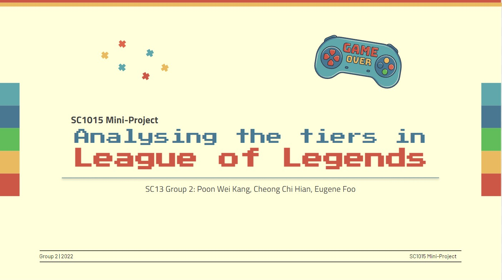

# SC1015  Mini Project - _League of Legends_

## About
This is a project for SC1015 (Introduction to Data Science and Artificial Intelligence) which focuses on **predicting the win rate in the game League of Legends using the data of the state of the game in the early game (first 15 minutes)**. For detailed walkthrough, please view the source code in the [Jupyter Notebooks](/Jupyter_notebooks) folder in order from: 
### 1. Data Analysis 
1. [Data_Analysis_part1.ipynb*](Jupyter_notebooks/Data_Analysis_part1.ipynb)
2. [Data_Analysis_part2.ipynb*](JUpyter_notebooks/Data_Analysis_part2.ipynb)
\
\
Require [match_15m.csv](data/match_15m.csv) and [match_full_time.csv](data/match_full_time.csv). We separate Data Analysis into 2 parts as a single notebook is too big  to be uploaded onto github. The code in the notebooks are used to analyze the 
 **macro decisions** against **win rate** in the first 15 minutes of the match. Each analysis is done by **tiers** to see if players in different tiers vary in decision-making and playstyle. Some **data cleaning** and **feature engineering** is done for the analysis. **Plotly** is used to visualize the data. 
### 2. [Data Cleaning](/Jupyter_notebooks/Data_Cleaning.ipynb)  
   Require [match_15m.csv](data/match_15m.csv) and [match_full_time.csv](data/match_full_time.csv). This notebook is used to **combine all the data 
   cleanings** (including those from Data Analysis) to generate a cleaned data csv file for our model training.  
### 3. [Machine Learning](/Jupyter_notebooks/Model_training.ipynb)  
   Require [blueTeam_cleaned_data.csv](data/blueTeam_cleaned_data.csv). This notebook is used to perform **machine learning** on the cleaned dataset. We use 
   [Logistic Regression](https://pythonfordatascienceorg.wordpress.com/logistic-regression-python/) function to create 2 models - one with the **number of dragon takedowns**, the other with the **specific types of dragons being killed**. We then compare the outcome of the models to see how each feature affect the outcome of the game
   
\
_(*) some notebooks might not be rendered fully in Github due to the large filesize. Please visit the links in NBViewer for full render:_
1. [Data_Analysis_part1.ipynb](https://nbviewer.org/github/kang5647/SC1015-Mini-Project/blob/main/Jupyter_notebooks/Data_Analysis_part1.ipynb)
2. [Data_Analysis_part2.ipynb](https://nbviewer.org/github/kang5647/SC1015-Mini-Project/blob/main/Jupyter_notebooks/Data_Analysis_part2.ipynb)
3. [Data_Cleaning.ipynb](https://nbviewer.org/github/kang5647/SC1015-Mini-Project/blob/main/Jupyter_notebooks/Data_Cleaning.ipynb)
4. [Model_training.ipynb](https://nbviewer.org/github/kang5647/SC1015-Mini-Project/blob/main/Jupyter_notebooks/Model_training.ipynb)
## Problem Statement
> **_Given the 15-minute dataset: Estimate the Chances of Winning the Game based on the Macro Decisions_**
## Model used 
* Logistic Regression 
## Conclusion 
* Players in all tiers **value objectives** that could bring **more gold difference**, i.e. **Towers**, **Kills**, **First Blood**, **First Tower**
* In higher tier, players value the **number** of each objective taken more than the **first** of every objective
* **Any** type of dragons secured **add** to the probability of **winning** the game
## What Did We Learn from this Project?
1. Understanding and Applying a Different **Machine Learning** Tool for our Project
      * E.g. **Logistic Regression** and its **Assumptions** to be Met to have a **Effective Model**
2. Applying a Different **Visualization** Tool 
      * **Plotly** (Refer to the notebook for the interaction with Plotly charts)
## Slides
* A copy of our [video presentation slides](SC1015_LeagueOfLegends.pptx) is included in the repository.
## Contributors 
1. Poon Wei Kang - **Data Analysis**
2. Eugene Foo - **Data Cleaning**, **Machine Learning** 
3. Cheong Chi Hian - **Data Visualization**, **Machine Learning**

## References
1. Dataset from: [https://www.kaggle.com/datasets/park123/lol-data](https://www.kaggle.com/datasets/park123/lol-data)
2. Plotly: [https://plotly.com/python/](https://plotly.com/python/ ) 
3. Ordinal Encoding: [https://towardsdatascience.com/feature-engineering-ordinal-variables-bfea697f5eee](https://towardsdatascience.com/feature-engineering-ordinal-variables-bfea697f5eee)
4. Logistic Regression: [https://pythonfordatascienceorg.wordpress.com/logistic-regression-python/ ](https://pythonfordatascienceorg.wordpress.com/logistic-regression-python/)
5. Feature Scaling: [https://scikit-learn.org/stable/modules/generated/sklearn.preprocessing.StandardScaler.html](https://scikit-learn.org/stable/modules/generated/sklearn.preprocessing.StandardScaler.html ) 
6. League of Legends Map: [https://leagueoflegends.fandom.com/wiki/Map_(League_of_Legends).](https://leagueoflegends.fandom.com/wiki/Map_(League_of_Legends).) 
